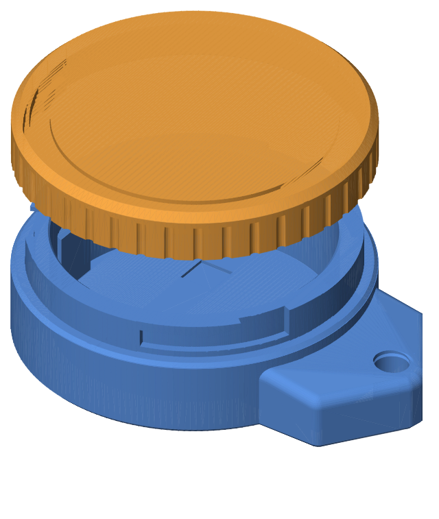
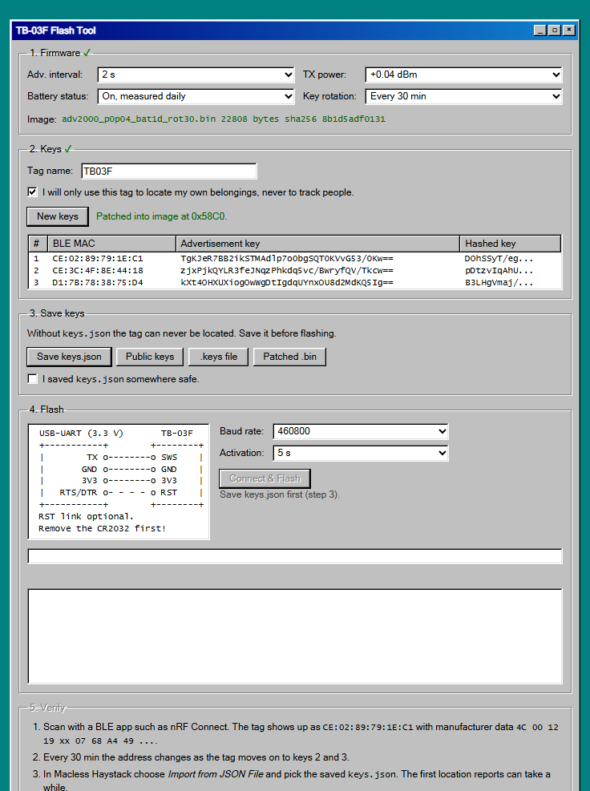
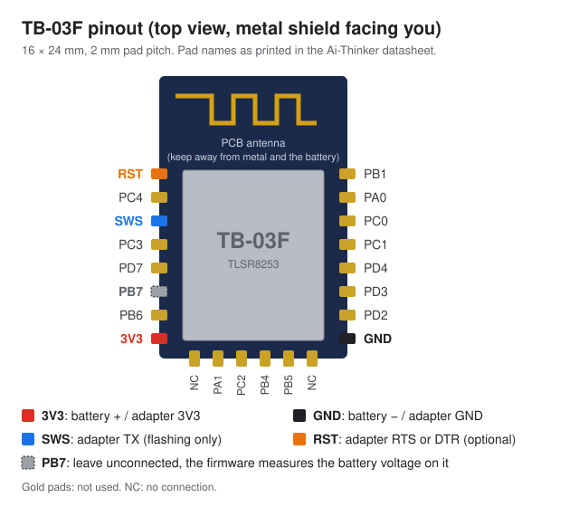
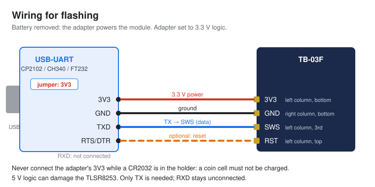
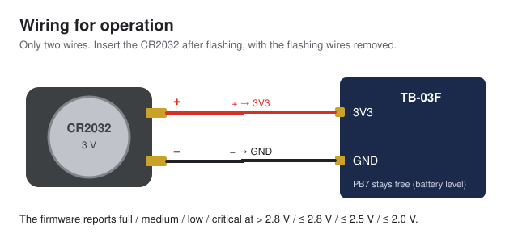

# TB-03F DIY Tracker

Build your own Bluetooth tracker that is located through Apple's **Find My** network, without a Mac and without any
programming. You need an Ai-Thinker **TB-03F** module, a coin cell, a 3D-printed case, and a flasher that runs
completely offline in your browser.

<p align="center">
  
  
</p>

<p align="center">
  <a href="../../releases/latest/download/TB03F-Flasher.html"><b>⬇ Download the flasher (TB03F-Flasher.html)</b></a>
  · <a href="#what-you-need">Parts</a> · <a href="#1-flash-the-firmware">Flash</a> · <a href="#6-see-it-on-a-map">Map</a>
  · <a href="#troubleshooting">Troubleshooting</a>
</p>

> [!WARNING]
> Use this only to find **your own things**. Tracking people without their consent is illegal in most countries.
> This project is not affiliated with or endorsed by Apple. It uses the Find My network the same way the
> [OpenHaystack](https://github.com/seemoo-lab/openhaystack) research project does, and Apple may change that at any time.

## Contents

- [How it works](#how-it-works)
- [What you need](#what-you-need)
- [1. Flash the firmware](#1-flash-the-firmware)
- [2. Check that it works](#2-check-that-it-works)
- [3. Solder the battery holder](#3-solder-the-battery-holder)
- [4. Print the case](#4-print-the-case)
- [5. Assemble](#5-assemble)
- [6. See it on a map](#6-see-it-on-a-map)
- [Troubleshooting](#troubleshooting)
- [FAQ](#faq)
- [Credits and licenses](#credits-and-licenses)

## How it works

1. **The tag** broadcasts a Bluetooth beacon containing a public key, the same kind of beacon a lost AirTag sends.
   It holds three keys and switches between them at a fixed interval.
2. **Any iPhone, iPad or Mac nearby** picks up the beacon and encrypts its own location with that public key.
   It uploads the encrypted report to Apple. Apple cannot read it; neither can the device owner.
3. **[Macless Haystack](https://github.com/dchristl/macless-haystack)** downloads the reports for your keys with an Apple ID.
   It decrypts them with the private keys from your `keys.json` and shows the locations on a map.

The tag has no GPS and no internet connection. It is found wherever Apple devices pass by.

The flasher (`TB03F-Flasher.html`) is one file that you open from your disk. It creates the keys in your browser, writes
them into the firmware, and flashes the module over USB. The page has no permission to send anything over the network,
so your keys never leave your computer.

## What you need

### Parts

| Part | Qty | Notes | Buy |
|---|---|---|---|
| **Ai-Thinker TB-03F** BLE module (TLSR8253) | 1 | Must be the **TB-03F**. The TB-03 and TB-04 are different modules. | [Shop][shop-tb03f] |
| **CR2032 holder** with solder tabs | 1 | Holds the coin cell inside the case. | [Shop][shop-holder] |
| **CR2032** 3 V coin cell | 1 | A brand-name cell lasts longer. | [Shop][shop-cr2032] |
| **USB-UART adapter** with **3.3 V logic** | 1 | Reusable for every tag. Needs TX, GND and 3V3 pins; RTS or DTR is optional. Boards with a 3.3 V / 5 V jumper (CP2102, CH340, FT232) are fine. | [Shop][shop-uart] |
| 3D-printed case | 1 | Body and lid; [STL files below](#4-print-the-case). | – |

<!-- When these are affiliate links, mark each one with " *" and enable the disclosure at the end of this file. -->

### Tools

- Soldering iron, solder and some thin wire (about 0.2 mm² / 24–30 AWG)
- A 3D printer, or a print service
- A computer with **Chrome, Edge or Opera** (Windows, macOS, Linux or ChromeOS) for flashing
- Optional: an **Android** phone with [nRF Connect](https://play.google.com/store/apps/details?id=no.nordicsemi.android.mcp) to check the tag
- For the map: a computer that can run **Docker**, and an **Apple ID** with two-factor authentication by **SMS**

## 1. Flash the firmware

Flash the bare module first. The battery holder comes later, so for now the USB-UART adapter powers the module.

### Connect the adapter

The TB-03F has castellated pads with 2 mm spacing. For flashing you need four of them:

<p align="center"></p>

| Pad | Position (shield facing you, antenna at the top) | Adapter pin |
|---|---|---|
| **3V3** | left column, bottom | **3V3** |
| **GND** | right column, bottom | **GND** |
| **SWS** | left column, 3rd from top | **TX** |
| **RST** | left column, top | **RTS** or **DTR**, optional |

Solder thin temporary wires to these pads and connect them to the adapter. The RST wire is optional, but it makes
flashing more reliable.



- Set the adapter to **3.3 V**. 5 V can damage the module.
- Leave **PB7** (left column, 6th from top) unconnected, now and later. The firmware measures the battery voltage on it.

<!-- PHOTO: TB-03F with temporary flashing wires, connected to the adapter -->

### Generate keys and flash

1. **Download** [`TB03F-Flasher.html`](../../releases/latest/download/TB03F-Flasher.html) and open it in **Chrome, Edge or
   Opera** (double-click it, or right-click → *Open with*). It works offline; nothing gets installed.

2. **Firmware:** choose how the tag behaves. Each combination is a separate pre-built firmware image.

   | Setting | Options | Recommendation |
   |---|---|---|
   | Adv. interval | 100 ms, 500 ms, 1 s, 2 s | **2 s** for everyday use. Shorter intervals are noticed more often by passing iPhones but drain the battery faster. |
   | TX power | +0.04 dBm, +10.29 dBm | **+0.04 dBm** for battery life; +10.29 dBm for more range. |
   | Battery status | Off, daily, every 7 days, every 14 days | **Daily**. Macless Haystack can then show full / medium / low / critical. |
   | Key rotation | 2, 10, 30 min | **30 min**. This is how long each of the three keys is broadcast before the next one takes over. |

3. **Keys:** enter a name for the tag, tick the box confirming you'll only track your own things, and click
   **Generate keys**. Every tag needs its own keys.

4. **Save keys:** click **Save keys.json** and keep the file somewhere safe.

   > [!CAUTION]
   > `keys.json` is the only way to locate this tag. Anyone who has it can see where the tag is. Don't share it and
   > don't commit it to Git. If you lose it, the only fix is to flash the tag again with new keys.

   *Public keys* (no secrets), the *.keys file* (the `generate_keys.py` format, which includes the private keys) and the
   *patched .bin* are optional extras.

5. **Flash:** plug the adapter into USB, click **Connect & Flash** and choose its port, for example *USB Serial* or
   *CP2102* / *CH340*. Flashing takes about 15 seconds, and the log shows each step. When it says *Done*, the module
   restarts with the new firmware.

## 2. Check that it works

Leave the adapter plugged in; it keeps powering the module.

1. Open **nRF Connect** on an Android phone and scan. The tag appears with the **BLE MAC** shown in step 5 of the flasher.
   Its manufacturer data is **Apple (0x004C)** and starts with `12 19`.
2. After the key-rotation time, the address changes to key 2's MAC, and later to key 3's (all three are listed in the
   flasher's key table).

The connection to the module is write-only, so this scan is how you confirm the flash worked. iPhones hide Bluetooth
addresses from apps, so use Android or a desktop BLE scanner. If the tag doesn't show up, see
[Troubleshooting](#troubleshooting) and flash again. It's easiest while the wires are still on.

## 3. Solder the battery holder

Once the tag works:

1. Unplug the adapter and remove the temporary flashing wires.
2. Solder the holder's **+** tab to **3V3** and its **−** tab to **GND**. Keep the wires short.

   

3. Insert the CR2032. The tag starts broadcasting again; nRF Connect shows it as before.

> [!CAUTION]
> To reflash a tag later, take the coin cell out first. Never connect the adapter's 3V3 while a coin cell is in the
> holder: a lithium coin cell must not be charged.

<!-- PHOTO: soldering the battery holder (step by step) -->

## 4. Print the case

Print the case once the tag works.

| File | Size |
|---|---|
| [`case/tracker_case_body.stl`](case/tracker_case_body.stl) | 45.7 × 36.0 × 11.8 mm, with a keyring lug (Ø 3.6 mm hole) |
| [`case/tracker_case_lid.stl`](case/tracker_case_lid.stl) | Ø 36.0 × 5.2 mm, twist-on lid |

GitHub shows both files in 3D when you click them.

- Print both parts the way they are oriented in the files: the body with its floor down, the lid with its top face down.
- No supports are needed. The internal slot under the keyring lug has a bridge of about 17 mm, so make sure bridging
  and part cooling are on.
- Suggested settings: PLA or PETG, 0.2 mm layers, 3 perimeters, 20 % infill. Together the parts use less than 10 g of
  filament.

<!-- PHOTO: printed body and lid -->

## 5. Assemble

1. Place the module and the battery holder in the body. Keep the module's **antenna end** (the zig-zag trace at the
   end opposite the pads) away from the battery and any metal.
2. Put the lid on and **twist it** to lock it.

<!-- PHOTO: electronics in the open body, then the closed tracker -->

## 6. See it on a map

[Macless Haystack](https://github.com/dchristl/macless-haystack) fetches and decrypts the location reports. These are
the steps from its README as of October 2026; if they differ, follow
[their current instructions](https://github.com/dchristl/macless-haystack#setup).

1. Install [Docker](https://www.docker.com/). You also need an **Apple ID with two-factor authentication by SMS**;
   other second factors are not supported. Consider using a separate Apple ID for this.
2. Start the services:

   ```bash
   docker network create mh-network
   ```

   ```bash
   docker run -d --restart always --name anisette -p 6969:6969 --volume anisette-v3_data:/home/Alcoholic/.config/anisette-v3 --network mh-network dadoum/anisette-v3-server
   ```

   ```bash
   docker run -it --restart unless-stopped --name macless-haystack -p 6176:6176 --volume mh_data:/app/endpoint/data --network mh-network christld/macless-haystack
   ```

   The last command asks for your Apple ID, password and SMS code. When it prints `serving at port 6176 over HTTP`,
   setup is done. Run `docker restart macless-haystack` in another terminal to keep it running in the background.
3. Open the web app at **<https://dchristl.github.io/macless-haystack/>**, or use their Android app.
   Go to **Accessories**, click **+**, choose **Import from JSON File** and select your `keys.json`.
4. Locations appear once Apple devices have passed the tag. That depends on how busy the area is, so give it some time.

If Macless Haystack runs on a different computer than your browser, set its address in the app's settings. See
[their FAQ](https://github.com/dchristl/macless-haystack/blob/main/FAQ.md) for HTTPS setups.

## Troubleshooting

<details>
<summary><b>The browser shows no serial port</b></summary>

- Use Chrome, Edge or Opera on a desktop computer. The flasher needs Web Serial, which most other browsers don't offer.
- Use a USB cable that carries data; some cables only charge.
- Windows usually installs the CP210x or CH340 driver automatically. If not, install it from the chip maker.
- On Linux, your user needs access to serial ports (usually the `dialout` group).
</details>

<details>
<summary><b>Flashing says "Done", but the tag doesn't show up</b></summary>

- Check that **TX** goes to **SWS**. TX to RX is the usual mistake.
- Increase **Activation** to 8 or 16 s. A module that already runs this firmware sleeps between beacons and has to be
  caught awake. Wiring **RTS/DTR → RST** fixes this for good.
- Try a lower **baud rate** (230400 or 115200), especially with long wires.
- Make sure the module got power during flashing: adapter 3V3 to 3V3, and GND to GND.
</details>

<details>
<summary><b>The tag shows up, but no locations appear</b></summary>

- Check that `docker logs macless-haystack` shows no login errors. The Apple ID needs SMS two-factor authentication.
- Make sure you imported the `keys.json` that belongs to this tag. Every flash creates new keys.
- Leave the tag somewhere iPhones pass by regularly, and wait.
</details>

<details>
<summary><b>I lost keys.json</b></summary>

The private keys exist nowhere else, so the tag can't be located any more. Flash it again with new keys, then import
the new `keys.json`.
</details>

<details>
<summary><b>I want different settings</b></summary>

Take the coin cell out, connect the adapter as in [step 1](#1-flash-the-firmware) and flash again with new settings.
The adapter's 3V3 and GND can go to the battery holder's + and − tabs. The flasher always generates new keys, so import
the new `keys.json` and delete the old accessory.
</details>

## FAQ

**Does the tag show up in Apple's Find My app?**
No. Only Macless Haystack, or another OpenHaystack-compatible app with your keys, can show it.

**How long does the battery last?**
That depends mostly on the advertising interval and TX power. 2 s at +0.04 dBm is the most frugal combination in the
flasher. If you measure it, please share your results in an issue.

**Is this legal?**
Locating your own property is legal in most places. Tracking a person without consent is not. This is not legal advice.

**Can I build the firmware myself?**
Yes. See [Building from source](docs/building-from-source.md), which also explains the firmware format and the
flashing protocol.

## Credits and licenses

- Firmware: [stefexec/TB-03F-OpenHaystack-Firmware](https://github.com/stefexec/TB-03F-OpenHaystack-Firmware) (Telink
  BLE SDK), built with configurable parameters and a few power fixes.
- Flashing protocol: [pvvx](https://github.com/pvvx/ATC_MiThermometer) (TLSR825x USB-COM flash writer).
- Location reports: [Macless Haystack](https://github.com/dchristl/macless-haystack) by dchristl, based on
  [OpenHaystack](https://github.com/seemoo-lab/openhaystack) by SEEMOO (TU Darmstadt).

This project's code (`web/`, `scripts/`, `test/`) is licensed under the [MIT License](LICENSE). The guide, the images
and the case design (`README.md`, `docs/`, `case/`) are licensed under
[CC BY-NC-SA 4.0](LICENSE-CC-BY-NC-SA-4.0.md): you may share and adapt them for non-commercial purposes with
attribution. Third-party components are listed in [THIRD_PARTY_NOTICES.md](THIRD_PARTY_NOTICES.md).

<!--
AFFILIATE DISCLOSURE: uncomment this section once the shop links are affiliate links.

## Affiliate links

Links marked with * are affiliate links. If you buy through them, I may earn a small commission at no extra cost to you.
It helps keep this project going.

(Keep this sentence only if you use Amazon links:) As an Amazon Associate I earn from qualifying purchases.
-->

<!-- SHOP LINKS: used by the parts table. Replace with your own (affiliate) links. -->
[shop-tb03f]: https://www.aliexpress.com/w/wholesale-tb-03f.html
[shop-holder]: https://www.aliexpress.com/w/wholesale-cr2032-battery-holder.html
[shop-cr2032]: https://www.aliexpress.com/w/wholesale-cr2032.html
[shop-uart]: https://www.aliexpress.com/w/wholesale-cp2102-usb-uart.html
